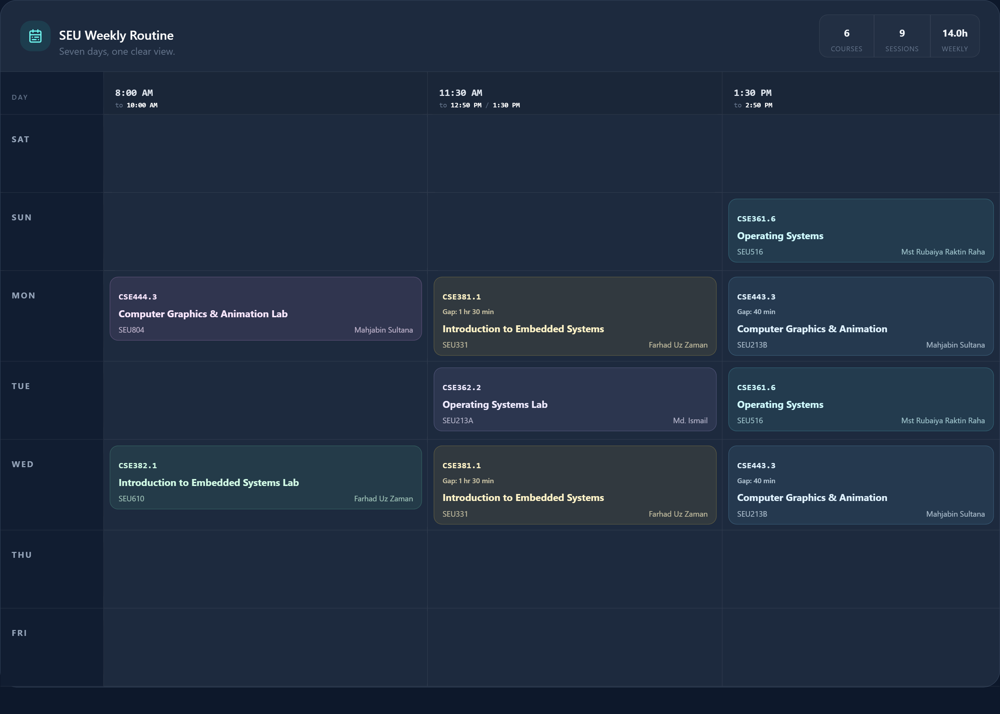
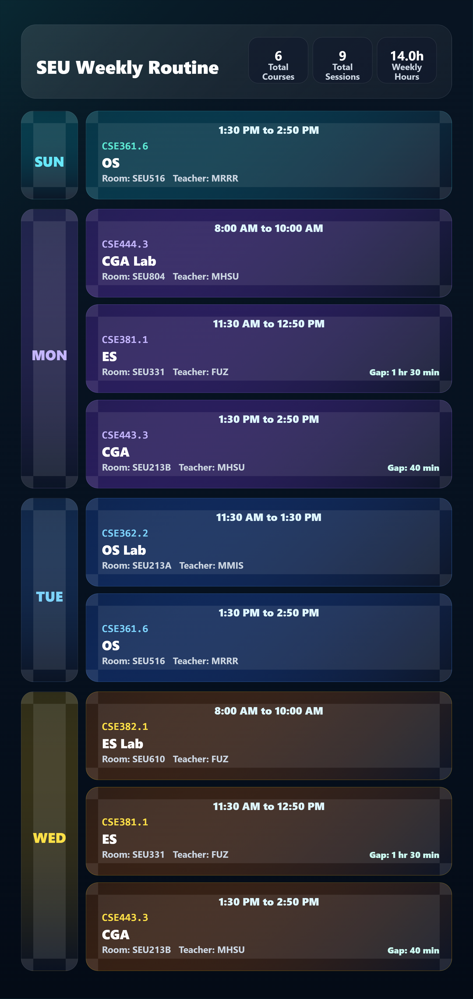
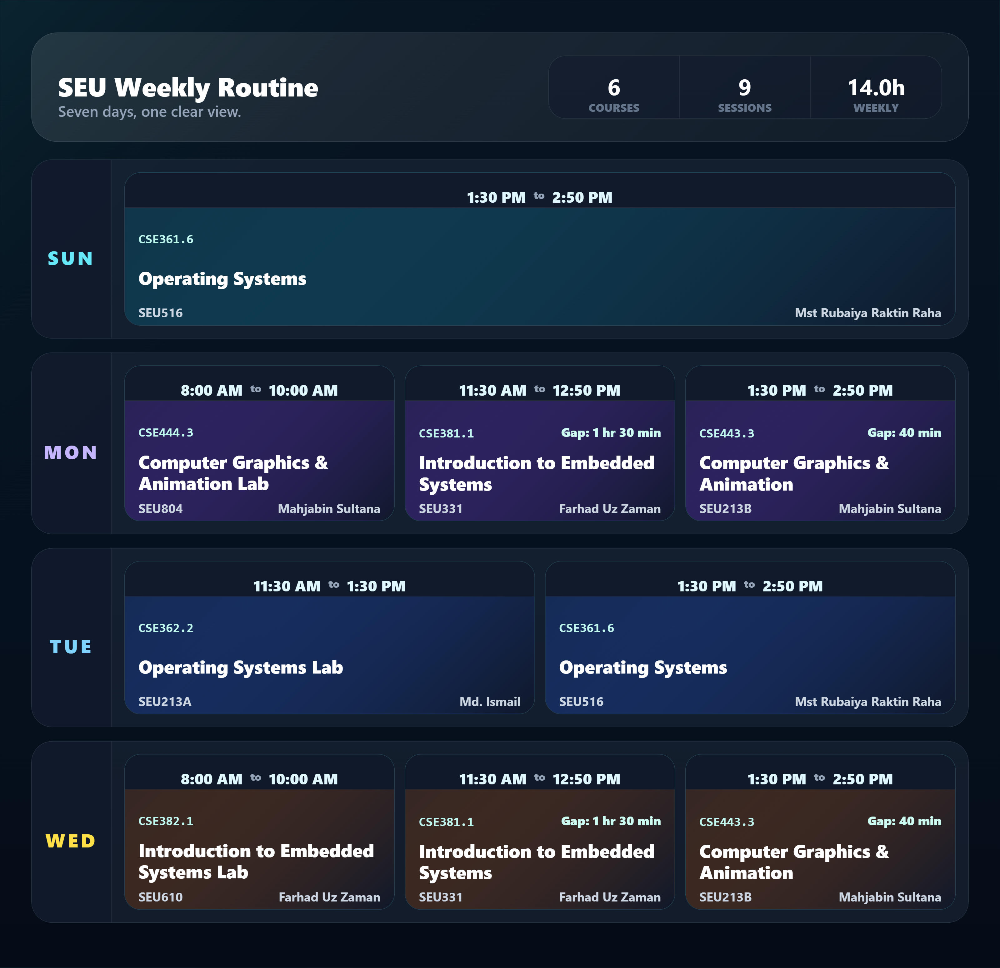
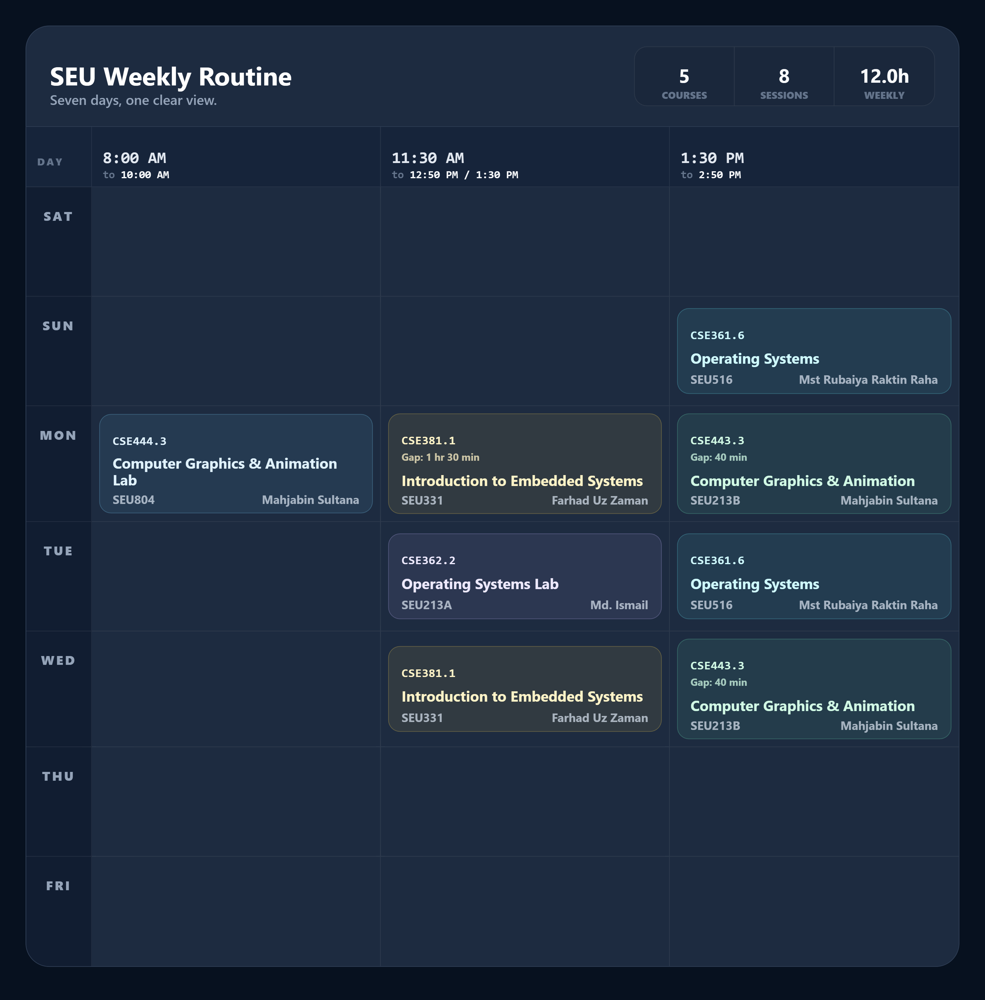

<div align="center">
  

  # SEU Routine Maker

  **A fast, private, and mobile-friendly weekly routine builder for Southeast University students.**

  Plan sections from the UMS Offered Sections page, rebuild a registered routine from the Student Dashboard, or pick course codes from a screenshot.

  
  
  
  
</div>

## Table of contents

- [About](#about)
- [PNG export showcase](#png-export-showcase)
- [Features](#features)
- [How to use the web app](#how-to-use-the-web-app)
- [Class reminders and calendar export](#class-reminders-and-calendar-export)
- [Course selection rules](#course-selection-rules)
- [Data storage, privacy, and security](#data-storage-privacy-and-security)
- [Deployment and search indexing](#deployment-and-search-indexing)
- [Project structure](#project-structure)
- [Technology](#technology)
- [License](#license)
- [Developer](#developer)

## About

SEU Routine Maker converts course information from the Southeast University UMS into a readable weekly routine. It parses course codes, titles, faculty initials, class days, start and end times, and rooms from both Offered Sections and Student Dashboard exports directly in the browser.

No account, backend, or external database is required for routine data. The app is designed for both desktop and mobile devices and uses a dark theme inspired by the SEU UMS.

## PNG export showcase

<div align="center">
  <p>
    SEU Routine Maker can export the same routine in four polished PNG styles for different use cases.
  </p>
</div>

### PC Version

<div align="center">
  
  <br />
  <sub>Wide desktop table export for full-screen viewing, printing, and sharing on larger displays.</sub>
</div>

### Modern Version

<div align="center">
  
  <br />
  <sub>Modern dark card layout with large readable text and a premium mobile-friendly presentation.</sub>
</div>

### Futuristic Version

<div align="center">
  
  <br />
  <sub>Futuristic dashboard export with glassy day rows, neon accents, and large subject cards.</sub>
</div>

### Mobile Version

<div align="center">
  
  <br />
  <sub>Compact phone-friendly table export that keeps the real PC grid identity while reducing wasted space.</sub>
</div>

## Features

- Upload a saved UMS page in `.html`, `.htm`, `.mhtml`, or `.mht` format. PDF and image uploads are also supported.
- Import PDF exports or clear PNG, JPG, WebP, BMP, and TIFF screenshots of the Registered Courses schedule.
- Paste raw UMS HTML manually.
- Parse UMS Offered Sections and Student Dashboard Registered Courses schedules.
- Detect a Registered Courses export, select its courses, generate the routine, and scroll to the result automatically.
- Store parsed data in browser `localStorage`.
- Type multiple section codes using commas, spaces, or new lines.
- Search saved sections by code or course title.
- Group organizer sections by schedule and filter them by course, teacher, exact time slot, or single/combined meeting days.
- Preview an organizer routine before opening the completed result in a new tab.
- Upload PNG, JPG, or WebP screenshots and detect course codes with PaddleOCR AI Studio.
- Update the routine live as section codes are added or removed.
- Display all seven days: SAT, SUN, MON, TUE, WED, THU, and FRI.
- Group classes with the same start time into one routine column, and merge the 8:00/8:30 AM columns when an 8:00 AM lab is selected.
- Show the duration of free gaps between consecutive classes each day.
- Detect exact and partial timetable conflicts as codes are entered.
- Prevent selecting more than one section of the same course.
- Edit automatically generated short course names.
- Switch routine cards between short/full course names and faculty initials/full names.
- Enable browser class reminders for 5, 10, 15, or 30 minutes before each class.
- Export the weekly routine as an `.ics` calendar file with built-in class alarms.
- Print the routine, export it as PDF, or download PNG versions for PC, Modern, Futuristic, and Mobile layouts.
- Restore the previous routine after reopening the browser.
- Clear only the routine or reset all saved data.
- Responsive layout with a horizontally scrollable routine table on small screens.

## How to use the web app

### Method 1: Before or during course advising

Use this method with the UMS **Offered Sections** page.

1. Sign in to the Southeast University UMS.
2. Open **Advising Table**.
3. Set **View Sections By** to **Preregistered**.
4. Wait until the full Offered Sections list is visible.
5. Save the page using the method for your device:
   - **PC / Laptop:** press `Ctrl + S`, select **Webpage, Complete** or **HTML**, and save the file.
   - **Android:** open the browser menu `⋮` and choose **Download**. Android browsers may save the page as `.mhtml`, `.mht`, or without any file extension; all of these are supported.
   - **iPhone / iPad:** use Safari **Share → Options → PDF → Save to Files**. If PDF is missing, use **Print**, pinch open the preview, then **Share → Save to Files**.
6. Open SEU Routine Maker.
7. Under **Add your UMS export**, upload the saved page. The importer supports HTML, MHTML, Android downloads without an extension, PDFs saved from iPhone Safari, and clear screenshots that include the course codes and schedules.
8. Wait for the success message confirming that the course sections were parsed and saved automatically.
9. Add section codes using any option:
   - Type or paste codes such as `CSE361.3`, one per line or separated by commas.
   - Use **Search saved sections** and select a result.
   - Open **Magic Organizer** to browse and filter all parsed sections visually.
10. Typed and searched codes update the routine immediately. In Magic Organizer, select **Create Routine** to open the completed routine in a new tab.

### Using the Magic Organizer filters

The organizer filters can be combined to narrow the section list:

1. Use **Filter by course** and **Filter by teacher** to limit the available sections.
2. Use **Time Slot** to select an exact class range shown in 12-hour format, such as `01:30 PM - 02:50 PM`.
3. Use **Day of Week** to select an exact single-day or combined-day schedule, such as **Sunday - Tuesday**.
4. Use the violet arrow button to collapse or expand the filter controls.
5. Select **Clear** to reset the search field and every active filter at once.
6. Select one section per course. The organizer asks before replacing a section and warns before adding a timetable conflict.
7. Use **Quick Preview**, copy the generated codes, or select **Create Routine** to save the selection and open the full routine.

### Method 2: After successfully completing course advising

Use this method to rebuild a routine from the courses visible on the Student Dashboard.

1. Sign in to UMS and open **Student Dashboard**.
2. Select the **Registered Courses** tab.
3. Wait until the registered-course schedules are fully visible, then save the page as an HTML or MHTML file.
4. Upload the saved file under **Add your UMS export**.
5. The app detects the Registered Courses page, selects every registered course, generates the routine automatically, and scrolls to the result.

> [!IMPORTANT]
> A Registered Courses export does not require a screenshot or OCR. The schedules in the saved page are enough to rebuild the routine.

### Optional: Pick codes from an image

The image scanner is useful when you have already imported an Offered Sections page and have a screenshot containing the section codes you want:

1. Upload and parse the relevant UMS HTML or MHTML export first.
2. Under **Pick codes from an image**, select a clear PNG, JPG, or WebP screenshot.
3. Wait for OCR to finish. Codes that match the parsed course data are added automatically.

> [!NOTE]
> OCR only selects codes that exist in the imported course data. Screenshots are sent through the app server to PaddleOCR AI Studio for text extraction and are not required for the Registered Courses method above.

To build a routine directly from an image, drop a clear screenshot of the **Registered Courses** page into **Add your UMS export**. The screenshot must show each course's schedule; a code-only image cannot provide missing class times.

### Supported code formats

The image scanner can recognize complete codes and tables where the course and section are shown separately:

```text
CSE361.3

CSE361: Operating Systems     Sec 3
```

Both examples are interpreted as `CSE361.3`.

### Editing short course names

After selecting courses, use the **Course labels** section to edit the name displayed inside routine cards. Changes are saved automatically.

Examples:

| Full title | Default short name |
|---|---|
| Operating Systems | OS |
| Operating Systems Lab | OS Lab |
| Introduction to Embedded Systems | ES |
| Introduction to Embedded Systems Lab | ES Lab |
| Computer Graphics & Animation | CGA |
| Computer Graphics & Animation Lab | CGA Lab |

### Printing and exporting

When the routine has no unresolved conflicts or duplicate-course selections, use:

- **Print** to open the browser print dialog.
- **PNG** to choose **Download PC PNG**, **Download Modern PNG**, **Download Futuristic PNG**, or **Download Mobile PNG**.
- **PDF** to download a landscape PDF.

## Class reminders and calendar export

After generating a routine, the **Class Reminders** panel can help you remember upcoming classes from the same browser.

1. Choose when to be reminded: **5**, **10**, **15**, or **30** minutes before class.
2. Select **Enable** and allow notification permission when the browser asks.
3. Keep the site or installed PWA open for browser reminders. The reminder shows the course name and room, then checks the routine again every minute.
4. Set the semester end date before exporting the calendar. The default can be reset from the same panel.
5. Select **Export to Phone Calendar (.ics)** to download a calendar file with weekly class events and reminder alarms.

Browser reminders are useful while the website is open. For daily phone notifications that still work after closing the website, import the `.ics` file into a calendar app such as Google Calendar, Apple Calendar, or Outlook.

## Course selection rules

### One section per course

Only one section of a course can be active. For example, `CSE362.3` and `CSE362.4` cannot both enter the final routine. If multiple sections are typed manually, the app displays **Keep** buttons so the user can choose one.

Selecting another section through autocomplete replaces the previous section of that course.

### Conflict detection

A conflict exists when two different courses overlap on the same day.

```text
Course A: SUN 13:30–15:30
Course B: SUN 15:00–16:20
Conflict: SUN 15:00–15:30
```

Classes at the same time on different days are not conflicts. Back-to-back classes are also allowed—for example, a class ending at `15:00` and another beginning at `15:00`.

When a conflict is found:

- The conflicting routine cards turn red.
- A live alert lists both codes, the day, and the overlapping time.
- Quick **Remove** buttons appear for the conflicting codes.
- Print, PNG, and PDF actions remain disabled until the conflict is resolved.

## Data storage, privacy, and security

### Is routine data stored permanently?

**UMS exports, parsed courses, and routines are not stored in a cloud database.** SEU Routine Maker has no user account system or routine database. HTML/PDF parsing, routine generation, and exports happen inside the user's browser. Screenshot OCR is sent through the app server to PaddleOCR AI Studio for text extraction.

The app uses browser `localStorage`, so routine data remains available in the same browser after closing or reopening the website. It stays there until the user selects **Reset saved data**, clears the browser's site data, or removes the browser profile.

| Data | Storage location | Retention |
|---|---|---|
| Imported raw UMS HTML | Browser `localStorage` | Until **Clear HTML**, **Reset saved data**, or browser site data is cleared |
| Parsed course sections | Browser `localStorage` | Until **Clear HTML**, **Reset saved data**, or browser site data is cleared |
| Selected course codes | Browser `localStorage` | Until **Clear routine**, **Clear HTML**, **Reset saved data**, or browser site data is cleared |
| Custom short names | Browser `localStorage` | Until **Clear HTML**, **Reset saved data**, or browser site data is cleared |
| Routine display preferences | Browser `localStorage` | Until **Clear HTML**, **Reset saved data**, or browser site data is cleared |
| Reminder enabled state, reminder time, and semester end date | Browser `localStorage` | Until changed in the app or browser site data is cleared |
| Calendar export file | Downloaded to the user's device by the browser | Managed by the user's device or calendar app after download |
| Uploaded screenshots | Sent to PaddleOCR AI Studio for OCR, then kept only in browser memory by the app UI | Cleared from the app after reset, reload, or leaving the page |
| Anonymous page-view metadata | Vercel Web Analytics | Managed under Vercel's analytics retention policy |

### Private by design

- No UMS HTML, routine, or course selection is uploaded to an application server.
- No UMS password or login credential is requested or collected.
- Uploaded screenshots are sent through the app server to PaddleOCR AI Studio for text extraction.
- The saved UMS HTML is parsed locally and is never rendered as executable page content.
- Browser reminders use the browser notification permission and local routine data; they do not require a routine database.
- Calendar export creates a local `.ics` file for the user to import into a calendar app.
- The deployed app uses [Vercel Web Analytics](https://vercel.com/docs/analytics/privacy-policy) for anonymous, cookie-free page-view statistics. It may record the page path, referrer, approximate location, browser, operating system, and device type, but it does not receive imported UMS data, screenshots, selected codes, or generated routines.
- **Clear HTML** removes imported HTML, parsed sections, selected codes, custom labels, routine data, and image-scanner state.
- **Clear routine** removes selected courses and resets the image scanner while keeping parsed UMS data.
- **Reset saved data** removes imported HTML, parsed courses, selections, custom labels, and image-scanner state from the app.

> [!IMPORTANT]
> Browser `localStorage` is not encrypted. Anyone with access to the same unlocked browser profile may be able to inspect locally saved data. On a shared or public device, use **Reset saved data** when finished and clear the browser's site data for additional privacy.

Routine content stays client-side by design. Local-device security still depends on the user's browser profile and device access, while anonymous site-usage metadata is handled by Vercel Web Analytics as described above.

## Deployment and search indexing

### Required environment variables

For local development, keep secrets in `.env.local`. For Vercel, add the same server-side variable in **Project Settings → Environment Variables** and redeploy.

| Variable | Required for | Notes |
|---|---|---|
| `PADDLEOCR_API_TOKEN` | Screenshot/image OCR | Baidu AI Studio PaddleOCR API token. Do not expose it with a `NEXT_PUBLIC_` prefix. |
| `NEXT_PUBLIC_SITE_URL` | Optional canonical URL override | Defaults to `https://seuroutine.vercel.app` when unset. |

If the PaddleOCR token was shared publicly or pasted into chat, rotate it in AI Studio and update both `.env.local` and Vercel.

### After deploying SEO changes

1. Confirm these live URLs work:
   - `https://seuroutine.vercel.app/manifest.webmanifest`
   - `https://seuroutine.vercel.app/favicon.svg`
   - `https://seuroutine.vercel.app/favicon-192.png`
   - `https://seuroutine.vercel.app/sitemap.xml`
   - `https://seuroutine.vercel.app/7e4d2c0a9b8f4e6db1a3c5f0e2d9a718.txt`
2. In Google Search Console, submit `https://seuroutine.vercel.app/sitemap.xml` and request indexing for the homepage.
3. In Bing Webmaster Tools, add the site, submit the same sitemap, and verify the site.
4. After the IndexNow key file is live, run:

```bash
npm run submit:indexnow
```

Search engines can take hours to weeks to update site names, favicons, snippets, and rankings after a deploy. Bing/Edge uses Bing's index; iPhone Safari usually uses Google unless the user changes the Safari search engine in settings.

## Project structure

```text
Seu-Routine_Maker/
├── docs/
│   └── images/
├── public/
│   ├── tesseract/
│   └── favicon.svg
├── scripts/
│   └── test-parser.mjs
├── src/
│   ├── components/
│   │   ├── AppHeader.jsx
│   │   ├── ConflictAlert.jsx
│   │   ├── CoursePicker.jsx
│   │   ├── DataPolicyModal.jsx
│   │   ├── ImageCourseScanner.jsx
│   │   ├── ImportPanel.jsx
│   │   ├── LoadingScreen.jsx
│   │   ├── RoutineTable.jsx
│   │   ├── SectionOrganizerPage.jsx
│   │   └── ShortNameEditor.jsx
│   ├── lib/
│   │   ├── ocr.js
│   │   ├── parser.js
│   │   ├── routine.js
│   │   ├── sectionGroups.js
│   │   └── storage.js
│   ├── App.jsx
│   ├── index.css
│   └── main.jsx
├── app/
│   ├── layout.tsx
│   ├── page.tsx
│   └── ...
├── package.json
├── next.config.mjs
├── tailwind.config.cjs
└── tsconfig.json
```

## Technology

- **Next.js** (App Router) for the user interface and SSR/SSG
- **React** for components
- **Tailwind CSS** for responsive styling
- **PaddleOCR AI Studio** for screenshot/image OCR
- **html2canvas** for PNG capture
- **jsPDF** for PDF export
- **Lucide React** for icons
- **localStorage** for browser persistence
- **Vercel Web Analytics** for anonymous page-view statistics

## License

MIT License

Copyright (c) 2026 Fardin Hossain

Permission is hereby granted, free of charge, to any person obtaining a copy
of this software and associated documentation files (the "Software"), to deal
in the Software without restriction, including without limitation the rights
to use, copy, modify, merge, publish, distribute, sublicense, and/or sell
copies of the Software, and to permit persons to whom the Software is
furnished to do so, subject to the following conditions:

The above copyright notice and this permission notice shall be included in all
copies or substantial portions of the Software.

THE SOFTWARE IS PROVIDED "AS IS", WITHOUT WARRANTY OF ANY KIND, EXPRESS OR
IMPLIED, INCLUDING BUT NOT LIMITED TO THE WARRANTIES OF MERCHANTABILITY,
FITNESS FOR A PARTICULAR PURPOSE AND NONINFRINGEMENT. IN NO EVENT SHALL THE
AUTHORS OR COPYRIGHT HOLDERS BE LIABLE FOR ANY CLAIM, DAMAGES OR OTHER
LIABILITY, WHETHER IN AN ACTION OF CONTRACT, TORT OR OTHERWISE, ARISING FROM,
OUT OF OR IN CONNECTION WITH THE SOFTWARE OR THE USE OR OTHER DEALINGS IN THE
SOFTWARE.

## Developer

Made by an SEU student.

Developed by [@Fardin_Hossain](https://mdfardin.vercel.app/).
